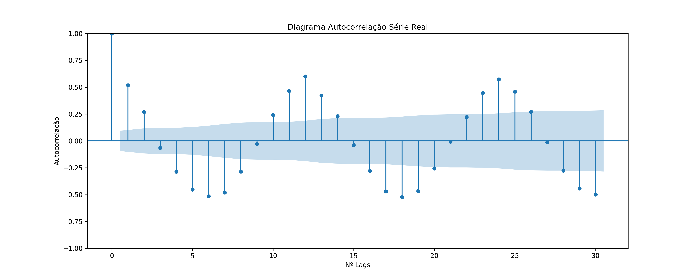

#Modelo da séries temporais - ARIMA

 **ARIMA:** Modelos autorregressivos integrados e de médias móveis 

 **Objetivo:** Implementação do modelo autorregressivo  de series temporais diposnível na biblioteca __statsmodels.tsa.arima.model__,  a fim de se determinar precipitação chuvosa.

  ## Modelos Uitlizados
 **Média móvel (MA):** Indica que o erro de regressão é uma combinação linear dos termos de erro dos valores passados.

 
 **Parâmetros ARIMA (p, d, q):**
     - p = ordem da autorregressão.
    - d = grau de diferenciação.
    - q = ordem da média móvel.(Combinação linear de erros passados)
    
 **Parâmetros Media móvel (0,0,q):**

### Série temporal estudada
1. Série temporal

1.1 Média movel sete dias serie temporal.

1.2 Série tempora decomposta.

1.3  Autocorrelation Function -Série Original
 
1.4 Partial Autocorrelation Function-Série Original

2. Transformação raíz cubica sobre a série
2.1 Série transformada

2.2  Quantile-Quantile Plot -Série raíz cúbica
 
2.3  Autocorrelation Function -Série raíz cúbica
 
2.4 Partial Autocorrelation Function-Série raíz cúbica

3. Aplicação Modelo Media Movel 
3.1 Estudo dos resíduos

3.2 Quantile-Quantile Plot-Rediduo -Modelo Média Movel
 

3.3 Autocorrelation Function-Resíduos -Modelo MA.

3.4. Partial Autocorrelation Function -Resíduos- -Modelo MA.

4 Resultados

4.1 Série e resíduos

4.2 Previsão e resíduo

